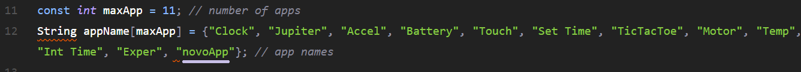
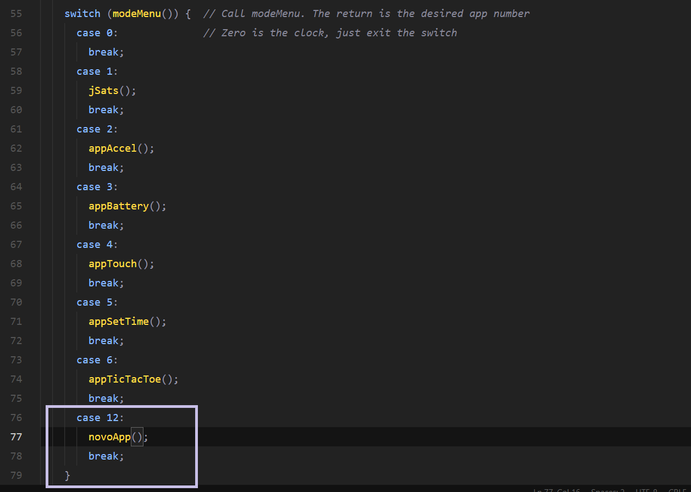

# Lilygo T-Watch-2020-v1 
##### Adcionando um novo app.

## Passo 1:
Em `menu.ino`, adcione o nome do novo app na variável `appName` (linha 12).

## Passo 2:
Em `TWatch_framework_0.ino`, adcione o app em `switch()`

## Passo 3:
Adcione os arquivos do novo app na pasta.

## Passo 4:
A pasta do projeto tem o arquivo `novoApp.ino`, um exemplo de como fazer um Hello World com o relógio.
